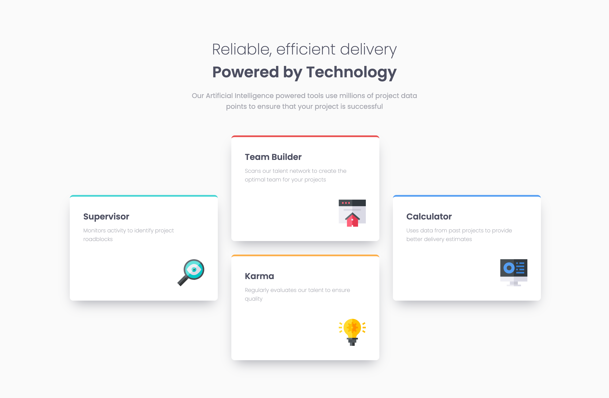
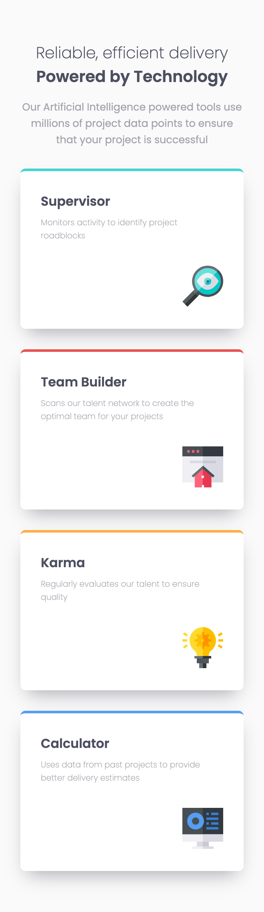

# Frontend Mentor - Four card feature section solution

This is a solution to the [Four card feature section challenge on Frontend Mentor](https://www.frontendmentor.io/challenges/four-card-feature-section-weK1eFYK). Frontend Mentor challenges help you improve your coding skills by building realistic projects. 

## Table of contents

- [Overview](#overview)
  - [The challenge](#the-challenge)
  - [Screenshot](#screenshot)
  - [Links](#links)
- [My process](#my-process)
  - [Built with](#built-with)
  - [What I learned](#what-i-learned)

## Overview

### The challenge

Users should be able to:

- View the optimal layout for the site depending on their device's screen size

### Screenshot

### Links

- Solution URL: (https://github.com/Jack-OC/Four-Card-Feature-Section)
- Live Site URL: (https://jack-oc.github.io/Four-Card-Feature-Section/)

## My process

### Built with

- Semantic HTML5 markup
- CSS custom properties
- Flexbox
- CSS Grid
- Mobile-first workflow

### What I learned
This was another good challenge to learn more about building webpages based on pre-made designs using HTML and CSS. This was a fairly straight forward challenge but gave me a chance to practice CSS Grid. As the feature cards in the desktop view design are aranged in a diamond formation, I had to learn more about CSS grid so I could place the feature card elements in specific places within the grid. Using grid-row-start/end and grid-column-start/end to specify where the elements start and stop in the grid. This is very useful property and I will continue to learn more about more ways it can be implemented in other challenges.
